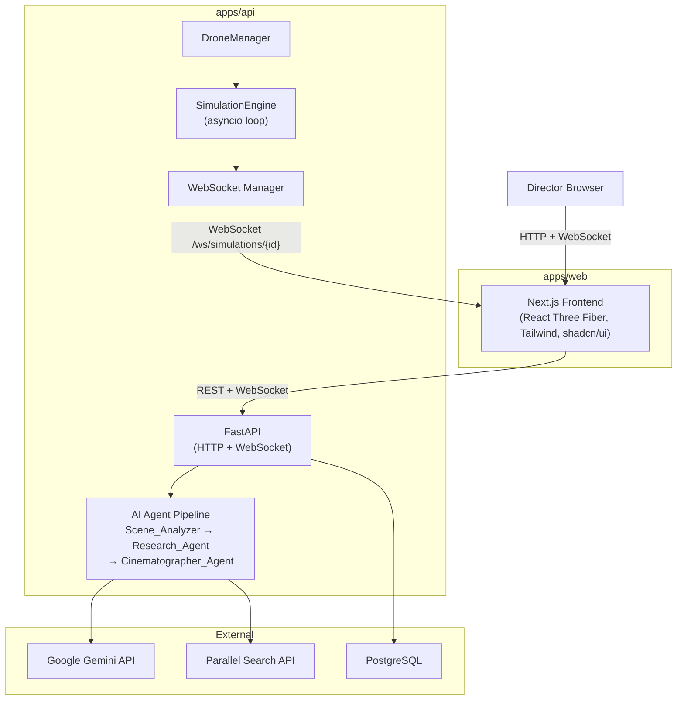
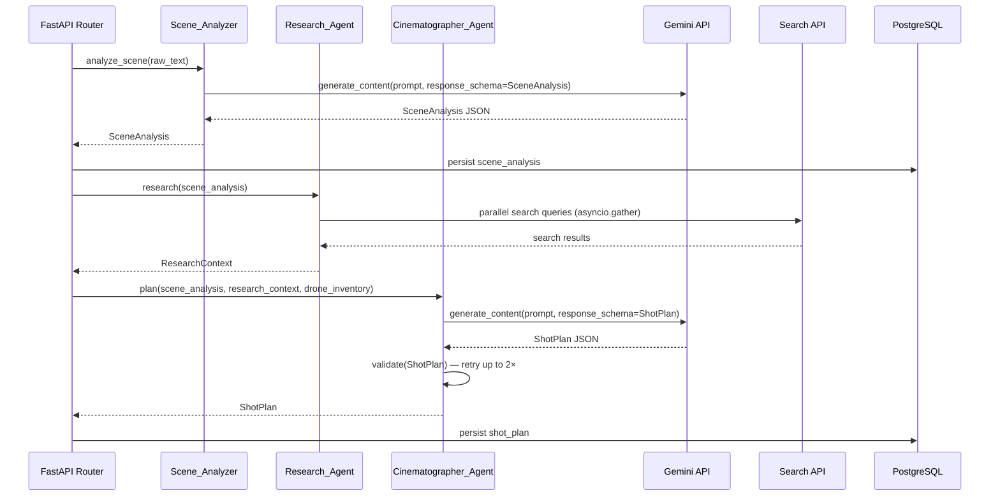
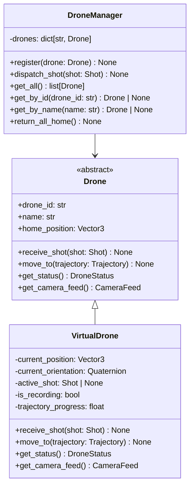
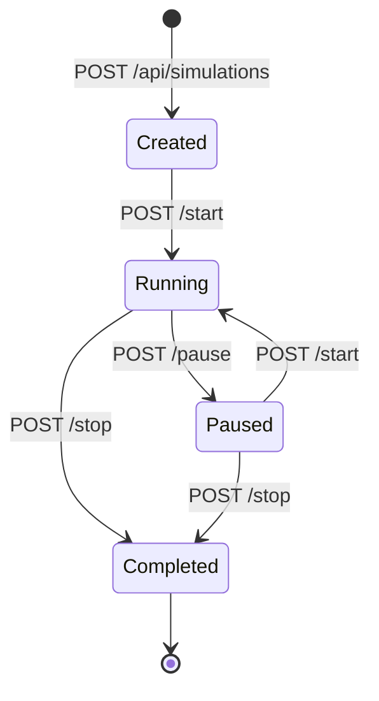
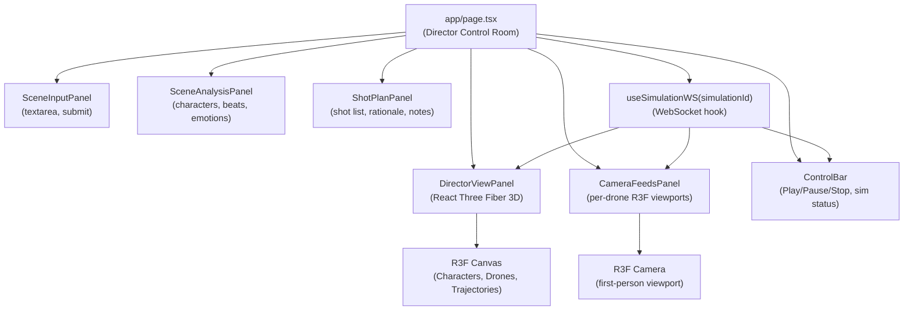

# Design Document — Cinematographer Agent (CA)

## Overview

CA is an AI-powered autonomous cinematography platform that transforms screenplay scenes into executable cinematography plans executed by named virtual camera drones in a 3D digital-twin simulation.

The system is built as a monorepo with a Next.js frontend (`apps/web`), a FastAPI backend (`apps/api`), and shared packages for type definitions and schema validation. The backend orchestrates a three-agent AI pipeline — Scene_Analyzer → Research_Agent → Cinematographer_Agent — to produce a validated ShotPlan. The ShotPlan is then executed by the DroneManager, which dispatches shots to VirtualDrone instances whose state is streamed in real time to the frontend over WebSocket.

The architecture has a single explicit seam: the `Drone` abstract interface. VirtualDrone implements it today; a future RealDrone adapter need only implement the same interface to operate against real hardware without touching the AI, planning, or frontend layers.

### Key Design Decisions

- **Pydantic v2 throughout the API** — schemas are single source of truth for validation and serialization; shared between Python API and TypeScript frontend via `packages/shared-types`.
- **Google Gemini** as the LLM backend for all three AI agents, invoked with structured output (response schema) to guarantee parseable JSON.
- **Parallel Search API (Tavily or equivalent)** called concurrently by Research_Agent using `asyncio.gather`.
- **PostgreSQL + SQLAlchemy (async)** for persistence; Alembic for migrations.
- **FastAPI WebSocket** for real-time streaming; simulation loop runs as a background `asyncio.Task`.
- **React Three Fiber (R3F) + Drei** for 3D rendering in the browser; Framer Motion for 2D panel transitions.
- **pnpm workspaces** for JS/TS package management; `uv` for Python dependency management.

---

## Architecture

### Monorepo Structure

```
cinematographer-agent/
├── apps/
│   ├── web/                          # Next.js 14 (App Router) frontend
│   │   ├── app/
│   │   │   ├── layout.tsx
│   │   │   ├── page.tsx              # Director Control Room root
│   │   │   └── api/                  # Next.js API routes (thin proxy, optional)
│   │   ├── components/
│   │   │   ├── scene-input/
│   │   │   ├── scene-analysis/
│   │   │   ├── shot-plan/
│   │   │   ├── director-view/        # React Three Fiber 3D scene
│   │   │   ├── camera-feeds/
│   │   │   └── control-bar/
│   │   ├── hooks/
│   │   │   ├── use-simulation-ws.ts  # WebSocket hook
│   │   │   └── use-shot-plan.ts
│   │   ├── lib/
│   │   │   └── api-client.ts
│   │   ├── tailwind.config.ts
│   │   └── package.json
│   │
│   └── api/                          # FastAPI backend
│       ├── app/
│       │   ├── main.py               # FastAPI app factory
│       │   ├── routers/
│       │   │   ├── scenes.py
│       │   │   ├── simulations.py
│       │   │   ├── drones.py
│       │   │   └── health.py
│       │   ├── agents/
│       │   │   ├── scene_analyzer.py
│       │   │   ├── research_agent.py
│       │   │   └── cinematographer_agent.py
│       │   ├── drone/
│       │   │   ├── base.py           # Drone abstract base class
│       │   │   ├── virtual_drone.py
│       │   │   └── manager.py        # DroneManager
│       │   ├── simulation/
│       │   │   ├── engine.py         # SimulationEngine (asyncio loop)
│       │   │   └── websocket.py      # WebSocket connection manager
│       │   ├── models/               # SQLAlchemy ORM models
│       │   │   ├── scene.py
│       │   │   ├── shot_plan.py
│       │   │   └── simulation.py
│       │   ├── db/
│       │   │   ├── session.py
│       │   │   └── migrations/       # Alembic
│       │   └── config.py
│       ├── pyproject.toml
│       └── tests/
│
├── packages/
│   ├── shared-types/                 # TypeScript types & enums
│   │   ├── src/
│   │   │   ├── index.ts
│   │   │   ├── scene.ts
│   │   │   ├── shot-plan.ts
│   │   │   ├── drone.ts
│   │   │   └── simulation.ts
│   │   └── package.json
│   ├── cinematography-schema/        # Pydantic v2 ShotPlan schema (Python)
│   │   ├── src/
│   │   │   └── schema.py
│   │   └── pyproject.toml
│   └── eslint-config/
│       ├── index.js
│       └── package.json
│
├── pnpm-workspace.yaml
└── package.json
```

### System Context Diagram



---

## Components and Interfaces

### AI Agent Pipeline

The three agents form a sequential pipeline triggered by `POST /api/scenes/{scene_id}/shot-plan`. Each agent is a stateless async function that takes typed Pydantic inputs and returns typed Pydantic outputs.



#### Scene_Analyzer

```python
# apps/api/app/agents/scene_analyzer.py

async def analyze_scene(raw_text: str) -> SceneAnalysis:
    """
    Calls Gemini with structured output schema to extract:
    characters, actions, emotions, cinematic_beats, dialogue.
    Raises GeminiError (→ HTTP 502) or InternalProcessingError (→ HTTP 500).
    """
```

#### Research_Agent

```python
# apps/api/app/agents/research_agent.py

async def research(scene_analysis: SceneAnalysis) -> ResearchContext:
    """
    Builds >= 2 search queries from emotional tone + cinematic beats.
    Executes queries in parallel via asyncio.gather with a 10-second timeout.
    Returns ResearchContext with research_sources list.
    Falls back to empty sources on timeout or total failure.
    """
```

#### Cinematographer_Agent

```python
# apps/api/app/agents/cinematographer_agent.py

async def plan(
    scene_analysis: SceneAnalysis,
    research_context: ResearchContext,
    drone_inventory: list[DroneInfo],
) -> ShotPlan:
    """
    Calls Gemini with full context. Validates output against cinematography-schema.
    Retries up to 2 additional times on validation failure.
    Raises ShotPlanValidationError (→ HTTP 500) if all attempts fail.
    """
```

### Drone Abstraction Layer



`DroneManager` interacts exclusively through the `Drone` abstract base class. It never imports `VirtualDrone` directly; drones are injected at application startup via `register()`. This is the seam that allows RealDrone adapters to be substituted.

### Simulation Engine



```python
# apps/api/app/simulation/engine.py

class SimulationEngine:
    """
    Manages the lifecycle of a single simulation run.
    Runs the main tick loop as an asyncio.Task at ~100 Hz.
    Publishes state updates to WebSocketManager at >= 10 Hz.
    """
    state: SimulationState  # Created | Running | Paused | Completed
    shot_queue: asyncio.Queue[Shot]

    async def start(self) -> None: ...
    async def pause(self) -> None: ...
    async def stop(self) -> None: ...
    async def _tick_loop(self) -> None: ...
    async def _dispatch_shots(self) -> None: ...
```

### WebSocket Connection Manager

```python
# apps/api/app/simulation/websocket.py

class WebSocketManager:
    """
    Maintains a registry of active WebSocket connections per simulation_id.
    Broadcasts typed events to all connected clients.
    """
    async def connect(self, simulation_id: str, ws: WebSocket) -> None: ...
    async def disconnect(self, simulation_id: str, ws: WebSocket) -> None: ...
    async def broadcast(self, simulation_id: str, event: SimulationEvent) -> None: ...
```

### Frontend Architecture



---

## Data Models

### Pydantic Schemas (Python — packages/cinematography-schema)

```python
from enum import Enum
from typing import Optional
from pydantic import BaseModel, Field, field_validator

class ShotType(str, Enum):
    WIDE = "WIDE"
    MEDIUM = "MEDIUM"
    CLOSE_UP = "CLOSE_UP"
    EXTREME_CLOSE_UP = "EXTREME_CLOSE_UP"
    OVER_SHOULDER = "OVER_SHOULDER"
    LOW_ANGLE = "LOW_ANGLE"
    HIGH_ANGLE = "HIGH_ANGLE"

class CameraMovement(str, Enum):
    STATIC = "STATIC"
    MOVE_TO = "MOVE_TO"
    DOLLY_IN = "DOLLY_IN"
    DOLLY_OUT = "DOLLY_OUT"
    TRACK = "TRACK"
    FOLLOW = "FOLLOW"
    ORBIT = "ORBIT"
    PAN = "PAN"
    TILT = "TILT"

class EmotionalTone(str, Enum):
    NEUTRAL = "NEUTRAL"
    TENSE = "TENSE"
    ROMANTIC = "ROMANTIC"
    MELANCHOLIC = "MELANCHOLIC"
    JOYFUL = "JOYFUL"
    FEARFUL = "FEARFUL"
    ANGRY = "ANGRY"

class Vector3(BaseModel):
    x: float
    y: float
    z: float

class Character(BaseModel):
    character_id: str
    display_name: str
    initial_position: Vector3

class Action(BaseModel):
    action_id: str
    character_id: str
    description: str
    timestamp_offset: float

class CinematicBeat(BaseModel):
    beat_id: str
    description: str
    timestamp_offset: float
    significance_score: int = Field(ge=1, le=10)

class DialogueLine(BaseModel):
    line_id: str
    character_id: str
    text: str
    narrative_position: float

class SceneAnalysis(BaseModel):
    scene_id: str
    title: str
    raw_text: str
    characters: list[Character]
    actions: list[Action]
    emotions: list[EmotionalTone]
    cinematic_beats: list[CinematicBeat]
    dialogue: list[DialogueLine]

class Shot(BaseModel):
    shot_id: str
    sequence: int
    shot_type: ShotType
    camera_movement: CameraMovement
    drone_name: str
    subject: str
    duration_seconds: float = Field(gt=0)
    rationale: str = Field(min_length=1, max_length=500)
    cinematic_beat_id: Optional[str] = None

class ResearchSource(BaseModel):
    query: str
    reference_count: int

class ShotPlan(BaseModel):
    plan_id: str
    scene_id: str
    shots: list[Shot] = Field(min_length=1, max_length=20)
    research_sources: list[ResearchSource]
    research_warning: Optional[str] = None
    cinematographer_notes: str

class DroneStatus(BaseModel):
    drone_id: str
    name: str
    position: Vector3
    orientation: dict  # quaternion {x, y, z, w}
    is_recording: bool
    active_shot: Optional[Shot] = None

class SimulationState(str, Enum):
    CREATED = "CREATED"
    RUNNING = "RUNNING"
    PAUSED = "PAUSED"
    COMPLETED = "COMPLETED"

class Simulation(BaseModel):
    simulation_id: str
    scene_id: str
    state: SimulationState
    created_at: str   # ISO 8601 UTC
    updated_at: str
```

### TypeScript Types (packages/shared-types)

```typescript
// packages/shared-types/src/index.ts
export * from "./scene"
export * from "./shot-plan"
export * from "./drone"
export * from "./simulation"

// packages/shared-types/src/shot-plan.ts
export type ShotType =
  "WIDE" | "MEDIUM" | "CLOSE_UP" | "EXTREME_CLOSE_UP" | "OVER_SHOULDER" | "LOW_ANGLE" | "HIGH_ANGLE"

export type CameraMovement =
  "STATIC" | "MOVE_TO" | "DOLLY_IN" | "DOLLY_OUT" | "TRACK" | "FOLLOW" | "ORBIT" | "PAN" | "TILT"

export interface Shot {
  shot_id: string
  sequence: number
  shot_type: ShotType
  camera_movement: CameraMovement
  drone_name: string
  subject: string
  duration_seconds: number
  rationale: string
  cinematic_beat_id?: string
}

export interface ShotPlan {
  plan_id: string
  scene_id: string
  shots: Shot[]
  research_sources: ResearchSource[]
  research_warning?: string
  cinematographer_notes: string
}
```

### PostgreSQL Schema

```sql
-- scenes table
CREATE TABLE scenes (
    scene_id        UUID PRIMARY KEY DEFAULT gen_random_uuid(),
    title           TEXT NOT NULL,
    raw_text        TEXT NOT NULL,
    analysis_json   JSONB NOT NULL,
    created_at      TIMESTAMPTZ NOT NULL DEFAULT NOW(),
    updated_at      TIMESTAMPTZ NOT NULL DEFAULT NOW()
);

-- shot_plans table
CREATE TABLE shot_plans (
    plan_id         UUID PRIMARY KEY DEFAULT gen_random_uuid(),
    scene_id        UUID NOT NULL REFERENCES scenes(scene_id),
    plan_json       JSONB NOT NULL,
    created_at      TIMESTAMPTZ NOT NULL DEFAULT NOW(),
    UNIQUE (scene_id)  -- one plan per scene; overwrite via UPDATE
);

-- simulations table
CREATE TABLE simulations (
    simulation_id   UUID PRIMARY KEY DEFAULT gen_random_uuid(),
    scene_id        UUID NOT NULL REFERENCES scenes(scene_id),
    state           TEXT NOT NULL DEFAULT 'CREATED',
    created_at      TIMESTAMPTZ NOT NULL DEFAULT NOW(),
    updated_at      TIMESTAMPTZ NOT NULL DEFAULT NOW()
);
```

All domain objects (SceneAnalysis, ShotPlan) are stored as JSONB to preserve schema flexibility while enabling indexed queries. The Pydantic models serve as the authoritative schema; SQLAlchemy models wrap the JSONB columns.

---

## API Design

### HTTP Endpoints

| Method | Path                               | Description                                                   |
| ------ | ---------------------------------- | ------------------------------------------------------------- |
| `POST` | `/api/scenes/analyze`              | Submit scene text; runs Scene_Analyzer; returns SceneAnalysis |
| `GET`  | `/api/scenes/{scene_id}`           | Retrieve persisted SceneAnalysis                              |
| `POST` | `/api/scenes/{scene_id}/shot-plan` | Run full AI pipeline; returns ShotPlan                        |
| `GET`  | `/api/scenes/{scene_id}/shots`     | Return ordered Shot list for a scene                          |
| `GET`  | `/api/drones`                      | List all Drone instances and their current status             |
| `GET`  | `/api/drones/{drone_id}`           | Get a single Drone's status and active shot                   |
| `POST` | `/api/simulations`                 | Create a new Simulation (body: `{scene_id}`)                  |
| `POST` | `/api/simulations/{id}/start`      | Transition Simulation to Running                              |
| `POST` | `/api/simulations/{id}/pause`      | Transition Simulation to Paused                               |
| `POST` | `/api/simulations/{id}/stop`       | Transition Simulation to Completed                            |
| `GET`  | `/health`                          | Health check; returns 200 or 503                              |

### WebSocket

| Path                              | Description                       |
| --------------------------------- | --------------------------------- |
| `/ws/simulations/{simulation_id}` | Real-time simulation state stream |

### WebSocket Event Schema

```typescript
// Emitted at >= 10 Hz during Running state
interface DroneUpdateEvent {
  type: "drone_update"
  timestamp: string // ISO UTC
  drones: DroneStatus[]
}

// On shot start
interface ShotStartedEvent {
  type: "shot_started"
  shot_id: string
  drone_id: string
  shot_type: ShotType
  camera_movement: CameraMovement
  subject: string
}

// On shot complete
interface ShotCompletedEvent {
  type: "shot_completed"
  shot_id: string
  drone_id: string
  shot_type: ShotType
  camera_movement: CameraMovement
  subject: string
}

// On state transition
interface SimulationStateChangeEvent {
  type: "state_change"
  simulation_id: string
  new_state: SimulationState
  timestamp: string
}
```

The WebSocket connection is closed by the server after emitting the `state_change` event when the simulation enters `Paused` or `Completed` state.

### Error Response Schema

```typescript
interface ErrorResponse {
  error: string // human-readable message
  code: string // machine-readable error code
  details?: unknown // structured validation errors (optional)
}
```

---

## Correctness Properties

_A property is a characteristic or behavior that should hold true across all valid executions of a system — essentially, a formal statement about what the system should do. Properties serve as the bridge between human-readable specifications and machine-verifiable correctness guarantees._

#### Reflection and Consolidation

Before writing properties, I reviewed the prework analysis and identified consolidation opportunities:

- Properties 4.2 (ShotType enum constraint) and 4.3 (CameraMovement enum constraint) can be combined with 4.4 (single drone assignment) and 4.5 (rationale length) into a single **Shot invariant** property, since all are structural invariants on every Shot in any ShotPlan. However, they test distinct fields, so keeping them as one combined property reduces redundancy while preserving coverage.
- Properties 2.1, 2.2, 2.3, 2.4, 2.5 are all structural invariants on the SceneAnalysis output — they can be consolidated into one property: "For any SceneAnalysis, all structural invariants hold."
- Properties 15.2 and 15.3 overlap: if serialize(deserialize(x)) == x (Property 15.2), then serialize(deserialize(serialize(x))) == serialize(x) follows. Property 15.3 is subsumed by Property 15.2. Keep Property 15.2 only.
- Properties 6.2, 6.3, 6.6, 6.7 are all about the simulation state machine. They can be combined into one state-machine transition correctness property.
- Properties 3.1 and 3.2 can be combined: research query construction and minimum count are both invariants on the research output for any scene.

After reflection, the consolidated property list is:

---

### Property 1: Input Validation Completeness

_For any_ input string, the client-side validation function shall return a non-empty descriptive error message if and only if the string has fewer than 10 characters or more than 10,000 characters; for any string with length in [10, 10000], validation shall return no error.

**Validates: Requirements 1.3**

---

### Property 2: SceneAnalysis Structural Invariants

_For any_ SceneAnalysis object returned by Scene_Analyzer:

- Every Character has a non-null `character_id`, `display_name`, and `initial_position`.
- Every Action has a non-null `character_id` that references a Character in the same SceneAnalysis.
- Every DialogueLine has a non-null `character_id` that references a Character in the same SceneAnalysis.
- Every `EmotionalTone` value is a member of the `EmotionalTone` enumeration.
- Every CinematicBeat has a non-empty `description`, a non-negative `timestamp_offset`, and a `significance_score` in [1, 10].

**Validates: Requirements 2.1, 2.2, 2.3, 2.4, 2.5**

---

### Property 3: SceneAnalysis Round-Trip

_For any_ valid SceneAnalysis object, serializing to JSON and deserializing back shall produce an object equal to the original in all field types, field values, enumeration values, optional field presence, and numeric precision.

**Validates: Requirements 2.6**

---

### Property 4: Research Query Invariants

_For any_ valid SceneAnalysis input, the Research_Agent shall construct at least 2 search queries, and each query string shall be non-empty.

**Validates: Requirements 3.1, 3.2**

---

### Property 5: ShotPlan Shot Count

_For any_ generated ShotPlan, the number of Shots shall be in the inclusive range [1, 20].

**Validates: Requirements 4.1**

---

### Property 6: Shot Structural Invariants

_For any_ Shot in any ShotPlan:

- `shot_type` is a member of `ShotType` (WIDE, MEDIUM, CLOSE_UP, EXTREME_CLOSE_UP, OVER_SHOULDER, LOW_ANGLE, HIGH_ANGLE).
- `camera_movement` is a member of `CameraMovement` (STATIC, MOVE_TO, DOLLY_IN, DOLLY_OUT, TRACK, FOLLOW, ORBIT, PAN, TILT).
- `drone_name` is a non-empty string.
- `rationale` has length in [1, 500].

**Validates: Requirements 4.2, 4.3, 4.4, 4.5**

---

### Property 7: Shot Sequence Monotonicity

_For any_ ShotPlan, the `sequence` field of each Shot shall be strictly increasing from the first Shot to the last.

**Validates: Requirements 4.6**

---

### Property 8: DroneManager Dispatch by Name

_For any_ ShotPlan and DroneManager with a registered set of named Drones, when the DroneManager dispatches a Shot, it shall call `receive_shot` on exactly the Drone whose `name` equals `shot.drone_name`. No other Drone shall have `receive_shot` called for that Shot.

**Validates: Requirements 5.4**

---

### Property 9: Simulation State Machine Correctness

_For any_ Simulation:

- Calling `start()` when state is `Created` or `Paused` shall transition state to `Running`.
- Calling `pause()` when state is `Running` shall transition state to `Paused`.
- Calling `stop()` when state is `Running` or `Paused` shall transition state to `Completed`.
- Calling `pause()` when state is NOT `Running` shall return an error / 409.
- Calling `start()` when state is `Completed` shall return an error / 409.
- Calling `stop()` when state is `Created` shall return an error / 409.

**Validates: Requirements 6.2, 6.3, 6.4, 6.6, 6.7**

---

### Property 10: ShotPlan Serialization Round-Trip

_For any_ valid ShotPlan object, serializing to JSON and then deserializing shall produce a ShotPlan equal to the original in: all field types, all field values, all enumeration field values (ShotType, CameraMovement), all optional fields (present or absent), and all numeric field values within floating-point precision. Additionally, `serialize(plan) == serialize(deserialize(serialize(plan)))` (idempotent serialization).

**Validates: Requirements 15.1, 15.2, 15.3**

---

### Property 11: Schema Validation Error Completeness

_For any_ JSON payload that violates the cinematography-schema (wrong type, missing required field, out-of-range value, invalid enum), the deserializer shall return a structured error containing at least one entry with a non-empty `field_path` and a non-empty `description` of the violation.

**Validates: Requirements 15.4**

---

## Error Handling

### Error Taxonomy

| HTTP Status | Scenario                                                                                         |
| ----------- | ------------------------------------------------------------------------------------------------ |
| 400         | Malformed request body (JSON parse failure, missing required fields)                             |
| 404         | scene_id, simulation_id, or drone_id not found                                                   |
| 409         | Invalid simulation state transition                                                              |
| 422         | Business rule violation (e.g., create simulation without ShotPlan)                               |
| 500         | Internal processing failure (post-Gemini logic, DB write failure, ShotPlan validation exhausted) |
| 502         | Upstream AI service (Gemini) error                                                               |
| 503         | Health check: dependency unavailable                                                             |

### Agent Error Handling

```python
# Gemini call wrapper pattern used by all agents
async def _call_gemini_with_schema(
    prompt: str,
    response_schema: type[BaseModel],
    *,
    max_retries: int = 3,
) -> BaseModel:
    for attempt in range(max_retries):
        try:
            raw = await gemini_client.generate_content(prompt, schema=response_schema)
            return response_schema.model_validate_json(raw)
        except GeminiAPIError:
            if attempt == max_retries - 1:
                raise GeminiError("Gemini API returned an error")
        except ValidationError:
            if attempt == max_retries - 1:
                raise ShotPlanValidationError("ShotPlan validation failed after 3 attempts")
```

### Database Write Atomicity

All DB writes are wrapped in a single SQLAlchemy `AsyncSession` transaction. On any exception, the session is rolled back, no partial record is committed, and the appropriate HTTP 500 response is returned.

### Research Agent Timeout

```python
async def research(scene_analysis: SceneAnalysis) -> ResearchContext:
    queries = _build_queries(scene_analysis)
    try:
        results = await asyncio.wait_for(
            asyncio.gather(*[search_api.query(q) for q in queries]),
            timeout=10.0,
        )
    except asyncio.TimeoutError:
        return ResearchContext(research_sources=[], research_warning="Research data unavailable: timeout")
```

---

## Testing Strategy

CA uses a dual testing approach: unit/property-based tests for logic correctness and integration tests for wiring, persistence, and external services.

### Property-Based Testing

**Library**: `hypothesis` (Python) for backend; `fast-check` (TypeScript) for frontend validation logic.

**Configuration**: Each property test runs a minimum of 100 examples (`@settings(max_examples=100)`).

**Tagging convention**:

```python
# Tag format: Feature: cinematographer-agent, Property N: <property text>
@settings(max_examples=100)
@given(shot_plan=st.from_type(ShotPlan))
def test_shotplan_roundtrip(shot_plan: ShotPlan):
    # Feature: cinematographer-agent, Property 10: ShotPlan Serialization Round-Trip
    json_str = shot_plan.model_dump_json()
    restored = ShotPlan.model_validate_json(json_str)
    assert restored == shot_plan
```

#### Property Tests (Python — `apps/api/tests/properties/`)

| Test File                           | Properties Covered                              |
| ----------------------------------- | ----------------------------------------------- |
| `test_scene_analysis_invariants.py` | Property 2, Property 3                          |
| `test_shot_plan_schema.py`          | Property 5, Property 6, Property 7, Property 10 |
| `test_schema_validation_errors.py`  | Property 11                                     |
| `test_research_agent.py`            | Property 4                                      |
| `test_drone_manager.py`             | Property 8                                      |
| `test_simulation_state_machine.py`  | Property 9                                      |

#### Property Tests (TypeScript — `apps/web/__tests__/properties/`)

| Test File                        | Properties Covered |
| -------------------------------- | ------------------ |
| `scene-input-validation.test.ts` | Property 1         |

### Unit Tests

Unit tests cover specific examples, integration points, and error conditions not addressed by property tests:

- Scene_Analyzer: Gemini API 502 mapping; internal 500 mapping (Requirements 2.7)
- Shot plan overwrite behavior (Requirement 4.11)
- DroneManager: unknown drone name skip-and-log (Requirement 5.9)
- WebSocket: snapshot-on-connect (Requirement 7.6); close on non-existent simulation (Requirement 7.5)
- Camera feed overlay rendering (Requirement 9.8)
- ShotPlan_Deserializer: non-schema failure path (Requirement 15.5)

### Integration Tests

Integration tests run against a test PostgreSQL instance (Docker Compose):

- Full pipeline: `POST /api/scenes/analyze` → `POST /api/scenes/{id}/shot-plan` → `GET /api/scenes/{id}/shots`
- Simulation lifecycle: create → start → pause → start → stop
- WebSocket streaming: verify drone_update events at >= 10 Hz over 1 second
- Health check: 200 with all deps healthy; 503 with DB down

### Frontend Tests

- Component tests with `@testing-library/react` for SceneInputPanel, ShotPlanPanel, ControlBar
- `fast-check` for Property 1 (input validation)
- 3D rendering tests use snapshot assertions on the R3F scene graph (no visual regression required)

### Test Execution

```bash
# Backend property + unit tests
cd apps/api && uv run pytest tests/ -v

# Frontend tests
cd apps/web && pnpm test --run
```
